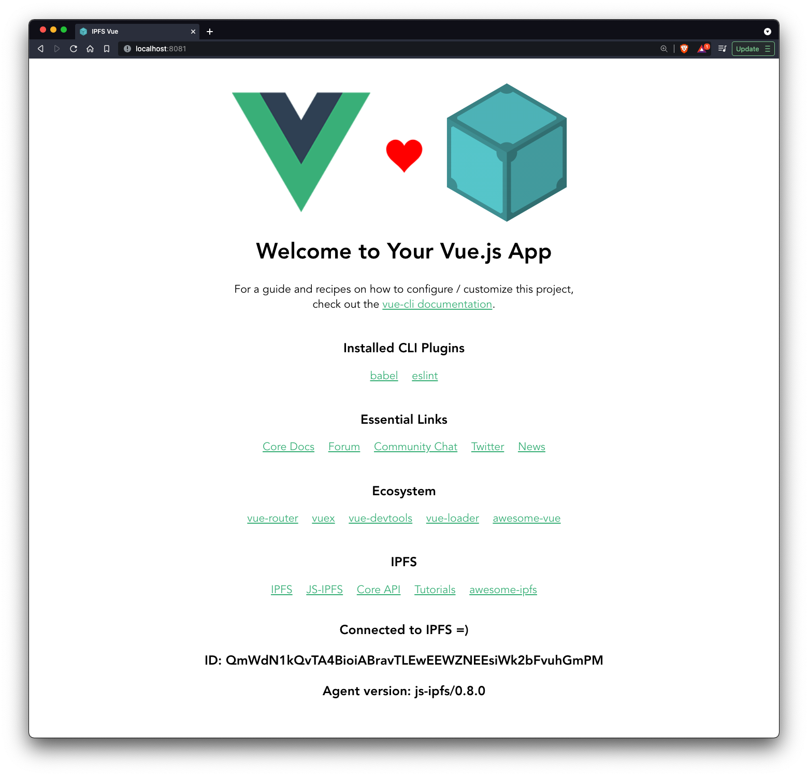

<a href="https://scenaristeur.github.io/browser-vue/" target="_blank">Demo</a>
using port 8082 for npm run serve because ipfs desktop / daemon uses 8080

# CIDS

- empty / : QmUNLLsPACCz1vLxQVkXqqLX5R1X345qqfHbsf67hvA3Nn : directory
- empty computer / : QmS66rS9dDPeHPZ7Htzu9fo5wCJbc7CKrBAABvBmtxqhq9 : directory
- computer with boot, io, kernel, os, processor, ram, test / : QmbFpibS9hRNJt6ous3EDUJUkbobctPGxP3gYPcqK5sQRL : directory
- computer above and home / : QmXVaYSe8EEmVQTsuYVYZ75dGyRmTpVskpLqAVZ2GAfeMC : directory
- another computer home test tmp / : QmYLMaBa9bd2cfkD8UU3boFC7bRrCR74KnxGF2cFrpbyLf : directory


- basic linux root filesystem QmVdxSLJwpfbzTyiHyiDGRDfdcG3WiTCrqQuqqa6ek63d5  https://tldp.org/LDP/sag/html/root-fs.html

- 16-Bit-Virtual-Machine
QmXW1it41S1Ap5ogskhSR1JLKhS7eWZr6atBQjsbbcVrbi
https://ipfs.io/ipns/k51qzi5uqu5dkuj0d4lkcpgv8eybu6e7wtoofxw0oh5as13ztzqu1lkd0nlzvn


#ipfs signalinaling webrtc server
https://discuss.ipfs.tech/t/trying-orbitdb-with-jsipfs-and-webrtc/15530/3

# ipfs js app
- https://medium.com/swlh/ipfs-nodejs-app-8e35f504d440

# execute js from IPFS  (examples in datatest folder)
- console.js QmdUc2BE8qU4F5i7Coq6axavDU1xCd3STEQmqH152ee2z3
- datatest QmUDFYFDtLuVMathoc8M2Dxjq8ja8K5Lvm1EhkPWqMet24

```
Swarm: [
"/ip4/0.0.0.0/tcp/4002",
"/ip4/127.0.0.1/tcp/4003/ws",
// "/dns4/wrtc-star1.par.dwebops.pub/tcp/443/wss/p2p-webrtc-star",
// "/dns4/wrtc-star2.sjc.dwebops.pub/tcp/443/wss/p2p-webrtc-star",
'/ip4/<PUBLIC_IP_WEBRTC_SERVER>/tcp/13579/wss/p2p-webrtc-star'
]
```

# cours
https://proto.school/course/ipfs


# tools
- ipfs gateways https://ipfs.github.io/public-gateway-checker/


<p align="center">
<a href="https://js.ipfs.io" title="JS IPFS">

</a>
</p>

<h3 align="center"><b>IPFS Vue App</b></h3>

<p align="center">
<b><i>Using js-ipfs in a vue cli project</i></b>
<br />
<br />

<br>
<a href="https://github.com/ipfs/js-ipfs/tree/master/docs">Explore the docs</a>
·
<a href="https://codesandbox.io/">View Demo</a>
·
<a href="https://github.com/ipfs-examples/js-ipfs-examples/issues">Report Bug</a>
·
<a href="https://github.com/ipfs-examples/js-ipfs-examples/issues">Request Feature/Example</a>
</p>

## Table of Contents

- [Table of Contents](#table-of-contents)
- [About The Project](#about-the-project)
- [Getting Started](#getting-started)
- [Pre requisites](#pre-requisites)
- [Installation and Running example](#installation-and-running-example)
- [Available Scripts from vue cli](#available-scripts-from-vue-cli)
- [Compiles and hot-reloads for development](#compiles-and-hot-reloads-for-development)
- [Compiles and minifies for production](#compiles-and-minifies-for-production)
- [Run your tests](#run-your-tests)
- [Lints and fixes files](#lints-and-fixes-files)
- [Customize configuration](#customize-configuration)
- [Usage](#usage)
- [References](#references)
- [Documentation](#documentation)
- [Contributing](#contributing)
- [Want to hack on IPFS?](#want-to-hack-on-ipfs)

## About The Project

- Read the [docs](https://github.com/ipfs/js-ipfs/tree/master/docs)
- Look into other [examples](https://github.com/ipfs-examples/js-ipfs-examples) to learn how to spawn an IPFS node in Node.js and in the Browser
- Consult the [Core API docs](https://github.com/ipfs/js-ipfs/tree/master/docs/core-api) to see what you can do with an IPFS node
- Visit https://dweb-primer.ipfs.io to learn about IPFS and the concepts that underpin it
- Head over to https://proto.school to take interactive tutorials that cover core IPFS APIs
- Check out https://docs.ipfs.io for tips, how-tos and more
- See https://blog.ipfs.io for news and more
- Need help? Please ask 'How do I?' questions on https://discuss.ipfs.io

## Getting Started

### Pre requisites

Make sure you have installed all of the following prerequisites on your development machine:

- Git - [Download & Install Git](https://git-scm.com/downloads). OSX and Linux machines typically have this already installed.
- Node.js - [Download & Install Node.js](https://nodejs.org/en/download/) and the npm package manager.

### Installation and Running example

```console
> npm install
> npm start
```

Now open your browser at `http://localhost:8081`

### Available Scripts from vue cli

In the project directory, you can run:

#### Compiles and hot-reloads for development

```console
$ npm run serve
```

#### Compiles and minifies for production

```console
$ npm run build
```

### Run your tests

```console
$ npm run test
```

#### Lints and fixes files

```console
$ npm run lint
```

#### Customize configuration

See [Configuration Reference](https://cli.vuejs.org/config/).

## Usage

A minimal demonstration of how to use `js-ipfs` with `Vue`.



This project was bootstrapped with [Vue CLI](https://cli.vuejs.org/).

_For more examples, please refer to the [Documentation](#documentation)_

## References

- Documentation:
- [IPFS CONFIG](https://github.com/ipfs/js-ipfs/blob/master/docs/CONFIG.md)
- [MISCELLANEOUS](https://github.com/ipfs/js-ipfs/blob/master/docs/core-api/MISCELLANEOUS.md)

## Documentation

- [Config](https://docs.ipfs.io/)
- [Core API](https://github.com/ipfs/js-ipfs/tree/master/docs/core-api)
- [Examples](https://github.com/ipfs-examples/js-ipfs-examples)
- [Development](https://github.com/ipfs/js-ipfs/blob/master/docs/DEVELOPMENT.md)
- [Tutorials](https://proto.school)

## Contributing

Contributions are what make the open source community such an amazing place to be learn, inspire, and create. Any contributions you make are **greatly appreciated**.

1. Fork the IPFS Project
2. Create your Feature Branch (`git checkout -b feature/amazing-feature`)
3. Commit your Changes (`git commit -a -m 'feat: add some amazing feature'`)
4. Push to the Branch (`git push origin feature/amazing-feature`)
5. Open a Pull Request

## Want to hack on IPFS?

[](https://github.com/ipfs/community/blob/master/CONTRIBUTING.md)

The IPFS implementation in JavaScript needs your help! There are a few things you can do right now to help out:

Read the [Code of Conduct](https://github.com/ipfs/community/blob/master/code-of-conduct.md) and [JavaScript Contributing Guidelines](https://github.com/ipfs/community/blob/master/CONTRIBUTING_JS.md).

- **Check out existing issues** The [issue list](https://github.com/ipfs/js-ipfs/issues) has many that are marked as ['help wanted'](https://github.com/ipfs/js-ipfs/issues?q=is%3Aissue+is%3Aopen+sort%3Aupdated-desc+label%3A%22help+wanted%22) or ['difficulty:easy'](https://github.com/ipfs/js-ipfs/issues?q=is%3Aissue+is%3Aopen+sort%3Aupdated-desc+label%3Adifficulty%3Aeasy) which make great starting points for development, many of which can be tackled with no prior IPFS knowledge
- **Look at the [IPFS Roadmap](https://github.com/ipfs/roadmap)** This are the high priority items being worked on right now
- **Perform code reviews** More eyes will help
a. speed the project along
b. ensure quality, and
c. reduce possible future bugs.
- **Add tests**. There can never be enough tests.
- **Join the [Weekly Core Implementations Call](https://github.com/ipfs/team-mgmt/issues/992)** it's where everyone discusses what's going on with IPFS and what's next
